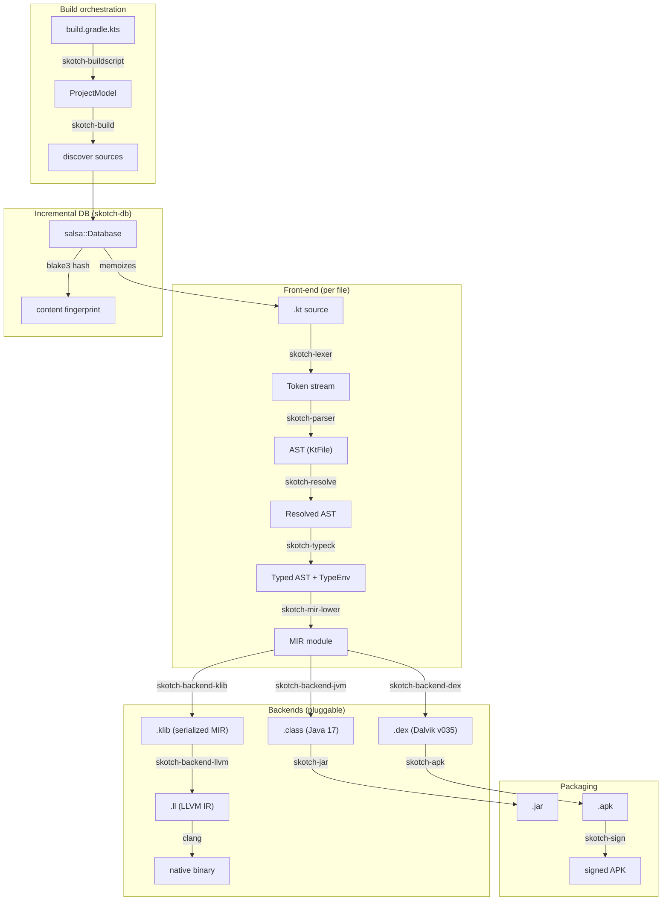
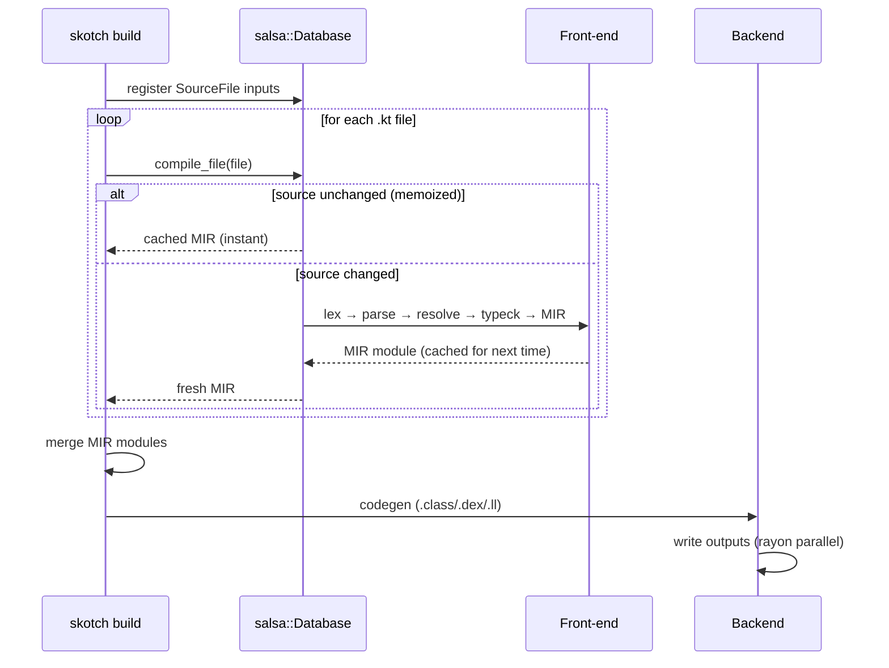

# skotch

A Rust toolchain that replaces the Kotlin compiler, Gradle, and Android SDK
build tools with a single CLI. Compiles Kotlin 2 sources to five target
formats:

| Target | Output | Pipeline |
|---|---|---|
| JVM | `.class` (Java 17, class file v61) | MIR → JVM bytecode |
| DEX | `.dex` (Dalvik v035) | MIR → DEX bytecode |
| klib | `.klib` (zip with serialized IR) | MIR → JSON IR → zip |
| LLVM IR | `.ll` (textual LLVM 19+) | MIR → klib → LLVM IR |
| Native | host executable | MIR → klib → LLVM IR → clang |

The shipping binary has no dependency on `kotlinc`, `kotlinc-native`, `javac`,
`d8`, `dx`, `gradle`, `aapt2`, or `apksigner`. The only external tool it
invokes is `clang`, for the native target's link step.

## Project goals

1. **One binary, fast builds.** Skip the JVM warm-up, Gradle daemon, and
   multi-GB SDK downloads. `skotch emit hello.kt -o hello.class` should
   feel instant.
2. **Multi-target from a single front-end.** One lex/parse/typeck/MIR
   pipeline; pluggable backends for JVM, DEX, native, wasm. Adding a new
   target means writing one backend crate.
3. **Validate against real toolchains.** Every supported fixture is built
   by skotch *and* by the corresponding reference tool (`kotlinc`, `d8`,
   `kotlinc-native`); outputs are committed to git so CI never needs the
   JDK or Android SDK.
4. **Parallel by default.** Modules × files × functions via Rayon's nested
   work-stealing.
5. **Modular workspace.** ~25 small crates with a strict dependency DAG;
   no crate knows about anything in a higher layer.

> **Status:** JVM, DEX, klib, LLVM IR, and native targets are shipping.
> Build orchestration, REPL, JAR packaging, and unsigned APK assembly are
> implemented. 148 language-feature fixtures validated (~20–25% of the Kotlin spec).

## Installation

### Homebrew (macOS / Linux)

```sh
brew install skotlang/tap/skotch
```

### Shell (Linux / macOS)

```sh
curl -fsSL https://github.com/skotlang/skotch/releases/latest/download/skotch-cli-installer.sh | sh
```

### PowerShell (Windows)

```powershell
powershell -ExecutionPolicy Bypass -c "irm https://github.com/skotlang/skotch/releases/latest/download/skotch-cli-installer.ps1 | iex"
```

### Pre-built binaries

Binaries for Linux, macOS, and Windows are published with each GitHub
release. Download the latest from the project's
[Releases](https://github.com/skotlang/skot/releases) page.

### From source

```sh
git clone https://github.com/skotlang/skot.git
cd skot
cargo build --release
# The binary lives at target/release/skotch
```

## Quick start: hello world on every target

```sh
# Write a Kotlin source file.
cat > hello.kt <<'EOF'
fun main() {
    println("Hello, world!")
}
EOF

# JVM:
skotch emit --target jvm hello.kt -o HelloKt.class
java -cp . HelloKt                     # → Hello, world!

# DEX (drop into an APK; verify with Android dexdump):
skotch emit --target dex hello.kt -o classes.dex
dexdump -d classes.dex                 # disassembles cleanly

# klib (the multi-stage pipeline waist):
skotch emit --target klib hello.kt -o hello.klib
unzip -l hello.klib                    # default/manifest, default/ir/, ...

# LLVM IR (consumes the klib internally):
skotch emit --target llvm hello.kt -o hello.ll
cat hello.ll                           # 13 lines of textual LLVM IR

# Native binary (clang link step):
skotch emit --target native hello.kt -o hello
./hello                                # → Hello, world!
```

## CLI subcommands

| Command | What it does | Status |
|---|---|---|
| `skotch emit --target T <input.kt> -o <out>` | Compile a single Kotlin file directly to target T. | shipping |
| `skotch build [-C dir] [--target T]` | Discover `build.gradle.kts`, compile and package (JAR/APK). | shipping |
| `skotch repl [--exec CODE] [--file F]` | Interactive REPL backed by in-process JVM. | shipping |
| `skotch run <script.kts>` | Execute a KotlinScript file. | shipping |
| `skotch test` | Discover `@Test` annotations, run the tests. | planned |

`skotch emit` is the testing surface: it bypasses build orchestration so
the lexer/parser/typeck/MIR/backend pipeline can be exercised directly
on a single source file. Build orchestration follows once the format
emitters are stable.

## Architecture

### Compilation pipeline

Every `.kt` source file flows through a layered pipeline. Each layer is a
separate crate with no upward dependencies:



### Incremental compilation (salsa + blake3)

The build pipeline uses [salsa](https://github.com/salsa-rs/salsa) for
memoized, demand-driven compilation:



**blake3** provides content hashing for file fingerprinting. **rayon**
parallelizes backend output (writing `.class` files, DEX encoding).

The salsa database is the foundation for future LSP integration — the
same `Db` instance can be held across edits, giving sub-millisecond
incremental re-analysis.

### Crate dependency layers

```
Layer 0  skotch-span, skotch-intern, skotch-config, skotch-diagnostics
Layer 1  skotch-syntax, skotch-lexer, skotch-parser
Layer 2  skotch-resolve, skotch-types, skotch-typeck
Layer 3  skotch-hir, skotch-mir, skotch-mir-lower
Layer 4  skotch-backend-{jvm,dex,llvm,wasm,klib,native}
Layer 5  skotch-{classfile,dex,llvm}-norm (golden normalizers)
Layer 6  skotch-jar, skotch-axml, skotch-apk, skotch-sign, skotch-classinfo
Layer 7  skotch-db (salsa incremental database)
Layer 8  skotch-build, skotch-driver, skotch-cli, skotch-repl, skotch-lsp
```

No crate imports from a higher layer. This strict DAG enables independent
testing and ensures backend changes can't break the front-end.

### Design principles

1. **No external compilers at runtime.** The binary never invokes `kotlinc`,
   `javac`, `d8`, or `aapt2`. `clang` is the only exception (native link step).
2. **Hand-rolled bytecode writers.** JVM constant-pool forward references and
   DEX section layout make code-gen libraries awkward. `byteorder` drives both
   the `.class` and `.dex` emitters directly.
3. **Textual LLVM IR.** No `inkwell`/`llvm-sys` dependency — avoids the
   `libLLVM` system requirement and compile-time hit.
4. **MIR is the narrow waist.** Every front-end feature lands in MIR; every
   backend reads MIR. Adding a target means writing one backend crate.
5. **Fixture-driven validation.** Every language feature is tested by compiling
   a `.kt` fixture, running it, and comparing stdout against a committed golden.

## Fixture-driven validation

Tests under `tests/fixtures/inputs/<name>/input.kt` are compiled by skotch
*and* by the corresponding reference tool. Both outputs are committed to
`tests/fixtures/expected/<target>/<name>/`:

```
tests/fixtures/expected/
    jvm/<f>/
        skotch.class               # skotch's bytes
        skotch.norm.txt            # normalized text
        kotlinc.class            # reference from kotlinc
        kotlinc.norm.txt
        run.stdout               # expected program output
    dex/<f>/
        skotch.dex
        skotch.norm.txt
        d8.dex                   # reference from kotlinc → d8
        d8.norm.txt
    klib/<f>/
        skotch.klib
        skotch.norm.txt
        kotlinc-native.klib      # reference from kotlinc-native
    llvm/<f>/
        skotch.ll
        skotch.norm.txt
        kotlinc-native.summary.txt   # tiny extract from kotlinc-native's IR
    native/<f>/
        run.stdout               # skotch binary's stdout
        kotlinc-native.run.stdout    # cross-compiler agreement check
```

The "normalized" text forms (produced by `skotch-classfile-norm`,
`skotch-dex-norm`, `skotch-llvm-norm`) strip cosmetic differences (constant
pool ordering, debug attributes, kotlin metadata, target triples) so
two compilers can be diffed without false positives. Byte-exact "self
golden" tests still catch regressions in skotch's own emitter.

## Kotlin language support

**Estimated coverage: ~55% of the Kotlin language specification.** The compiler
handles functions with default parameters and named arguments, `print()`/
`println()`, data classes, `maxOf()`/`minOf()`, complete control flow including
`for (i in a..b)`, `for (i in a until b)`, and `for (i in b downTo a)`, try/
finally, numeric types (Int, Long, Double), Boolean, String with 20+ methods
including `.repeat()`, Char, classes with mutable `var` field writeback and
`override fun toString()`, `++`/`--` operators, null/const/visibility modifiers,
nullable types with elvis (`?:`), Java interop, and Kotlin stdlib resolution.
295+ test fixtures.

### Implemented and stable

| Feature | Spec reference | Notes |
|---|---|---|
| [Function declarations](https://kotlinlang.org/spec/declarations.html#function-declaration) | §4.1 | Top-level `fun`, parameters, return types |
| [Default parameters](https://kotlinlang.org/spec/declarations.html#function-declaration) | §4.1.1 | `fun f(x: Int = 10)` — literal defaults injected at call sites |
| [Named arguments](https://kotlinlang.org/spec/expressions.html#named-and-default-arguments) | §7.2.2 | `f(height = 3, width = 4)` — arguments reordered to match parameter positions |
| [Expression body functions](https://kotlinlang.org/spec/declarations.html#function-declaration) | §4.1 | `fun f() = expr` shorthand |
| [Extension functions](https://kotlinlang.org/spec/declarations.html#extension-function-declaration) | §4.1.3 | `fun Int.isEven()`, `this` receiver, method chaining |
| [Local functions](https://kotlinlang.org/spec/declarations.html#local-function-declaration) | §4.1.4 | `fun` inside blocks, recursive calls |
| [Data classes](https://kotlinlang.org/spec/declarations.html#data-class-declaration) | §4.5.6 | `data class Point(val x: Int, val y: Int)` — synthesized `toString()` producing `"Point(x=1, y=2)"` |
| [Class declarations](https://kotlinlang.org/spec/declarations.html#class-declaration) | §4.5 | Primary constructor with `val`/`var`, field access, instance methods, `init` blocks, `invokevirtual` dispatch |
| [Const val](https://kotlinlang.org/spec/declarations.html#property-declaration) | §4.2 | `const val` compile-time constants inlined at call site |
| [Visibility modifiers](https://kotlinlang.org/spec/declarations.html#declaration-modifiers) | §4.3 | `private`, `internal`, `protected`, `open`, `abstract` — parsed and accepted (not yet enforced) |
| [Java interop](https://kotlinlang.org/spec/platform-specific-parts.html) | §18 | Real `.class` parsing from JDK jmods + CLASSPATH; deferred resolution; clear classpath errors |
| [Import declarations](https://kotlinlang.org/spec/packages-and-imports.html) | §9.2 | `import java.lang.Math`, implicit `java.lang.*` |
| [Variable declarations](https://kotlinlang.org/spec/declarations.html#property-declaration) | §4.2 | `val` (immutable), `var` (mutable), type annotations |
| [Integer literals](https://kotlinlang.org/spec/expressions.html#integer-literals) | §7.1.1 | Decimal, hex (`0xFF`), binary (`0b1010`), underscores (`1_000`), `L` suffix |
| [Character literals](https://kotlinlang.org/spec/expressions.html#character-literals) | §7.1.5 | `'A'`, escape sequences (`'\n'`, `'\t'`, `'\\'`) |
| [Boolean literals](https://kotlinlang.org/spec/expressions.html#boolean-literals) | §7.1.3 | `true`, `false` |
| [String literals](https://kotlinlang.org/spec/expressions.html#string-interpolation-expressions) | §7.1.4 | Regular, raw (`"""`), templates (`$x`, `${expr}`) |
| [Long literals](https://kotlinlang.org/spec/expressions.html#integer-literals) | §7.1.1 | `100L`, `0xFFL` — full 64-bit arithmetic (`+`, `-`, `*`, `/`, `%`), negation, values exceeding Int range |
| [Double/Float literals](https://kotlinlang.org/spec/expressions.html#real-literals) | §7.1.2 | `3.14`, `2.5e10`, `1.0f`, negative doubles, scientific notation |
| [Null literal](https://kotlinlang.org/spec/expressions.html#null-literal) | §7.1.6 | `null` value, `println(null)` |
| [Elvis operator](https://kotlinlang.org/spec/expressions.html#elvis-expressions) | §7.4.3 | `x ?: default` — null-check with fallback, supports chaining |
| [Nullable parameters](https://kotlinlang.org/spec/type-system.html#nullable-types) | §3.3 | `fun f(x: String?): String`, nullable function parameters |
| [Arithmetic operators](https://kotlinlang.org/spec/expressions.html#arithmetic-expressions) | §7.5 | `+`, `-`, `*`, `/`, `%` on `Int`, `Long`, and `Double` |
| [String concatenation](https://kotlinlang.org/spec/expressions.html#arithmetic-expressions) | §7.5 | `String + String`, `String + Int/Long/Double/Bool` |
| [Comparison operators](https://kotlinlang.org/spec/expressions.html#comparison-expressions) | §7.6 | `==`, `!=`, `<`, `>`, `<=`, `>=` (Int and String) |
| [Logical operators](https://kotlinlang.org/spec/expressions.html#logical-disjunction-expression) | §7.8–7.9 | `&&`, `\|\|` with short-circuit evaluation |
| [Unary operators](https://kotlinlang.org/spec/expressions.html#unary-expressions) | §7.3 | `-` (negation), `!` (not) |
| [Compound assignment](https://kotlinlang.org/spec/expressions.html#assignments) | §7.12 | `+=`, `-=`, `*=`, `/=`, `%=` |
| [Increment/decrement](https://kotlinlang.org/spec/expressions.html#postfix-increment-expression) | §7.3.4 | `x++`, `x--` — postfix operators on `var` locals and class fields |
| [Mutable class fields](https://kotlinlang.org/spec/declarations.html#property-declaration) | §4.2 | `var` fields in classes with method writeback; `count++` in methods persists |
| [Override toString()](https://kotlinlang.org/spec/declarations.html#overriding) | §4.5.1 | `override fun toString(): String` on regular classes |
| [Object declarations](https://kotlinlang.org/spec/declarations.html#object-declaration) | §4.5.4 | `object Singleton { fun greet() {} }` — methods as static functions; `Singleton.greet()` calls |
| [Enum classes](https://kotlinlang.org/spec/declarations.html#enum-class-declaration) | §4.5.7 | `enum class Color { RED, GREEN, BLUE }` — entries accessed via `Color.RED`, usable in `when` |
| [Companion objects](https://kotlinlang.org/spec/declarations.html#companion-object-declaration) | §4.5.4 | `companion object { fun create() }` — static methods via `ClassName.method()` |
| [If expression](https://kotlinlang.org/spec/expressions.html#conditional-expressions) | §7.4.1 | As statement and expression, with/without else |
| [When expression](https://kotlinlang.org/spec/expressions.html#when-expressions) | §7.4.2 | With subject, without subject, comma patterns, `in range`, string/int matching, nested |
| [Else-if chains](https://kotlinlang.org/spec/expressions.html#conditional-expressions) | §7.4.1 | `if {} else if {} else {}` (as statements) |
| [For loop](https://kotlinlang.org/spec/statements.html#for-loop-statements) | §8.2 | `..` (inclusive), `until` (exclusive), `downTo` (descending) |
| [While loop](https://kotlinlang.org/spec/statements.html#while-loop-statements) | §8.3 | `while (cond) { }` |
| [Do-while loop](https://kotlinlang.org/spec/statements.html#do-while-loop-statements) | §8.3 | `do { } while (cond)` |
| [Break and continue](https://kotlinlang.org/spec/expressions.html#break-and-continue-expressions) | §7.10 | In `for`, `while`, and `do-while` loops (including nested in `if`) |
| [Return](https://kotlinlang.org/spec/expressions.html#return-expressions) | §7.10 | Early return from functions, guard clauses (`if (cond) return expr` without braces) |
| [Recursive functions](https://kotlinlang.org/spec/declarations.html#function-declaration) | §4.1 | Direct recursion (factorial, GCD, power), mutual recursion, multi-parameter |
| [Function calls](https://kotlinlang.org/spec/expressions.html#function-calls-and-property-access) | §7.2 | Direct, nested, recursive, mutual recursion, extension method syntax |
| [`println`](https://kotlinlang.org/api/core/kotlin-stdlib/kotlin.io/println.html) | stdlib | `println()`, `println(Int)`, `println(Double)`, `println(String)`, `println(Boolean)`, `println(null)` |
| [String templates in expressions](https://kotlinlang.org/spec/expressions.html#string-interpolation-expressions) | §7.1.4 | `"$var"`, `"${expr}"` usable anywhere (val, return, args) |
| [Try-finally](https://kotlinlang.org/spec/expressions.html#try-expression) | §7.4.5 | `try { body } finally { cleanup }` — finally always executes after body |
| [String methods](https://kotlinlang.org/api/core/kotlin-stdlib/kotlin/-string/) | stdlib | `.length`, `.uppercase()`, `.lowercase()`, `.isEmpty()`, `.trim()`, `.substring()`, `.contains()`, `.startsWith()`, `.endsWith()`, `.indexOf()`, `.lastIndexOf()`, `.replace()`, `.get()`, `.equals()`, `.compareTo()`, `.toInt()`, `.toDouble()`, `.toLong()` |
| [Type conversions](https://kotlinlang.org/api/core/kotlin-stdlib/kotlin/-int/to-string.html) | stdlib | `Int.toString()`, `Long.toString()`, `Double.toString()`, `String.toInt()`, `String.toLong()`, `String.toDouble()` |
| [Init blocks](https://kotlinlang.org/spec/declarations.html#class-initialization) | §4.5.2 | `init { }` blocks execute during construction, access constructor params |
| [`print()`](https://kotlinlang.org/api/core/kotlin-stdlib/kotlin.io/print.html) | stdlib | `print()` without trailing newline — all type overloads |
| Language Server Protocol | — | Real-time diagnostics, semantic tokens, hover, go-to-definition, completions via `skotch lsp` |
| [Inheritance](https://kotlinlang.org/spec/declarations.html#class-declaration) | §4.5 | `open class`, `override fun`, `super` calls, 3-level chains, inherited fields |
| [Interfaces](https://kotlinlang.org/spec/declarations.html#interface-declaration) | §4.5.3 | Declaration, implementation, abstract + default methods, `invokeinterface` |
| [Abstract classes](https://kotlinlang.org/spec/declarations.html#abstract-classes) | §4.5.1 | `abstract class` with `abstract fun`, template method pattern |
| [Sealed classes](https://kotlinlang.org/spec/declarations.html#sealed-class-declaration) | §4.5.5 | Sealed hierarchies, exhaustive `when` + `is` patterns, smart cast narrowing |
| [Enum classes](https://kotlinlang.org/spec/declarations.html#enum-class-declaration) | §4.5.7 | Real MirClass with constructor params, `.name`, `when` matching |
| [Smart casts](https://kotlinlang.org/spec/type-system.html#smart-casts) | §3.6 | `is`/`!is` type checks (instanceof + checkcast), null-check narrowing |
| [Lambda expressions](https://kotlinlang.org/spec/expressions.html#lambda-literals) | §7.2.10 | Closure capture (val + var with Ref boxing), trailing lambda, `it`, nested lambdas |
| [Function types](https://kotlinlang.org/spec/type-system.html#function-types) | §3.5 | `(Int) -> String` syntax, receiver types, erased to Object on JVM |
| [Scope functions](https://kotlinlang.org/api/core/kotlin-stdlib/kotlin/let.html) | stdlib | `let`, `also`, `run`, `apply`, `with`, `repeat` — MIR intrinsics |
| [SAM conversions](https://kotlinlang.org/spec/expressions.html#sam-conversions) | §7.2.10.2 | `Interface { lambda }` → anonymous `object : Interface` |
| [Object expressions](https://kotlinlang.org/spec/expressions.html#object-literal) | §7.1.8 | `object : Interface { override fun ... }` |
| [Generics](https://kotlinlang.org/spec/declarations.html#type-parameters) | §4.6 | Generic functions/classes, upper bounds, variance (`in`/`out`), star projection, type erasure |
| [Reified type params](https://kotlinlang.org/spec/declarations.html#type-parameters) | §4.6 | `inline fun <reified T>` with `is T` check inlined at call site |
| [Type aliases](https://kotlinlang.org/spec/declarations.html#type-alias) | §4.7 | `typealias Name = Type` — parsed and resolved |
| [Property getters](https://kotlinlang.org/spec/declarations.html#property-declaration) | §4.2 | `val x: Int get() = expr` — custom getters compiled as synthetic methods |
| [Operator overloading](https://kotlinlang.org/spec/expressions.html#overloadable-operators) | §7.5 | `operator fun plus`, `operator fun invoke` — `a + b` desugars to `a.plus(b)`, `obj(x)` to `obj.invoke(x)` |
| [Try-catch](https://kotlinlang.org/spec/expressions.html#try-expression) | §7.4.5 | Full JVM exception tables; `catch (e: ArithmeticException) { }` |
| [Annotations](https://kotlinlang.org/spec/declarations.html#annotation-declaration) | §4.8 | `@Suppress`, `@Deprecated`, `@field:JvmField` — parsed and accepted (no codegen effect yet) |
| [listOf](https://kotlinlang.org/api/core/kotlin-stdlib/kotlin.collections/list-of.html) | stdlib | `listOf(1, 2, 3)` → `ArrayList`; `.forEach { }` iterator intrinsic |
| [For-in collections](https://kotlinlang.org/spec/statements.html#for-loop-statements) | §8.2 | `for (x in list)` → `iterator()/hasNext()/next()` desugaring |
| [Infix functions](https://kotlinlang.org/spec/declarations.html#function-declaration) | §4.1 | `infix fun` keyword parsed; dot-call form (`a.op(b)`) works |
| [IntArray](https://kotlinlang.org/api/core/kotlin-stdlib/kotlin/-int-array/) | stdlib | `IntArray(n)`, `arr[i]`, `arr[i] = v`, `arr.size` — JVM `newarray`/`iaload`/`iastore`/`arraylength` |
| [Destructuring](https://kotlinlang.org/spec/statements.html#destructuring-declarations) | §8.1 | `val (a, b) = point` → `component1()`/`component2()` calls; data class componentN auto-generated |
| [Varargs](https://kotlinlang.org/spec/declarations.html#function-declaration) | §4.1.2 | `fun sum(vararg numbers: Int)` — args packed into IntArray at call site; for-in over IntArray |
| [Lateinit var](https://kotlinlang.org/spec/declarations.html#property-declaration) | §4.2 | `lateinit var name: String` — declared without init, field defaults to null |
| [Secondary constructors](https://kotlinlang.org/spec/declarations.html#class-declaration) | §4.5.2 | `constructor(x: Int) : this(x, 0)` — multiple `<init>` methods, delegation chain |
| [Property delegation](https://kotlinlang.org/spec/declarations.html#delegated-property-declaration) | §4.2 | `val x by lazy { expr }` — desugared to eager init in constructor |
| [Interface delegation](https://kotlinlang.org/spec/declarations.html#delegated-classifier-declaration) | §4.5 | `class X : Base by b` — auto-generated forwarding methods |
| [Package declarations](https://kotlinlang.org/spec/packages-and-imports.html) | §9.1 | `package com.example` → `com/example/InputKt.class`; all class refs prefixed |
| [Higher-order functions](https://kotlinlang.org/spec/expressions.html#function-calls-and-property-access) | §7.2 | `fun apply(f: (Int)->Int, x: Int) = f(x)` — synthetic `$FunctionN` interfaces, `invokeinterface` dispatch, autoboxing |
| [Safe call (?.)](https://kotlinlang.org/spec/type-system.html#nullable-types) | §3.3 | `x?.length` — null-check + short-circuit to null; handles properties and methods |
| [Non-null assertion (!!)](https://kotlinlang.org/spec/type-system.html#nullable-types) | §3.3 | `x!!` — unwraps Nullable(T) to T for downstream dispatch |
| [Smart casts in when](https://kotlinlang.org/spec/type-system.html#smart-casts) | §3.6 | `when (x) { is String -> x.uppercase() }` — checkcast + scope narrowing in when branches |
| [Nullable enforcement](https://kotlinlang.org/spec/type-system.html#nullable-types) | §3.3 | `val x: String = null` → compile error; non-nullable types reject null |
| [Nothing type](https://kotlinlang.org/spec/type-system.html#nothing) | §3.8 | Bottom type; `throw` has type Nothing; assignable to all types |
| [Real kotlin-stdlib](https://kotlinlang.org/api/core/kotlin-stdlib/) | stdlib | `listOf()` calls real `CollectionsKt.listOf`; kotlin-stdlib.jar on JVM classpath at init |
| [Collection HOFs](https://kotlinlang.org/api/core/kotlin-stdlib/kotlin.collections/) | stdlib | `.map { }`, `.filter { }`, `.associateWith { }`, `.fold`, `.any`, `.first`, `.count`, 25+ extensions via real stdlib |
| [Pair/Triple](https://kotlinlang.org/api/core/kotlin-stdlib/kotlin/-pair/) | stdlib | `1 to "one"` infix syntax, `.first`/`.second`, real `kotlin.Pair` from stdlib |
| [Mutable collections](https://kotlinlang.org/api/core/kotlin-stdlib/kotlin.collections/) | stdlib | `mutableListOf(1,2,3)`, `.add()`, `.remove()`, `.clear()`, `list[i]` |
| [Ranges with step](https://kotlinlang.org/spec/expressions.html#range-expressions) | §7.5 | `for (i in 1..10 step 2)` — custom step in for loops |
| [mapOf / setOf](https://kotlinlang.org/api/core/kotlin-stdlib/kotlin.collections/) | stdlib | `mapOf(1 to "a")`, `setOf(1,2,3)` — real MapsKt/SetsKt from stdlib; `map[key]`, `.size`, `.keys` |
| [Try as expression](https://kotlinlang.org/spec/expressions.html#try-expression) | §7.4.5 | `val x = try { f() } catch (e: Exception) { default }` |
| [Enum values/valueOf](https://kotlinlang.org/spec/declarations.html#enum-class-declaration) | §4.5.7 | `Color.values()` returns list of entries; `Color.valueOf("RED")` |
| [Multi-line dot chains](https://kotlinlang.org/spec/syntax-and-grammar.html) | §1 | `list\n    .map { }\n    .filter { }` — newline before `.` continues expression |

### Not yet implemented

| Feature | Spec reference | Difficulty | Notes |
|---|---|---|---|
| Coroutines | [§7.2.11](https://kotlinlang.org/spec/expressions.html#coroutine-builder-invocations) | Very Hard | `suspend`, state machine CPS transform |
| Function references | [§7.2.8](https://kotlinlang.org/spec/expressions.html#callable-references) | Medium | `::functionName` syntax |

## Running the tests

```sh
# All unit + integration tests; needs no JDK or Android SDK.
cargo test --workspace

# Lint check (treat warnings as errors).
cargo clippy --workspace -- -D warnings
```

### Test policy

**Every fixture marked `status = "supported"` must produce correct output.**
The e2e tests dynamically discover all supported fixtures with `run.stdout`
expectations and verify them end-to-end (compile → run → compare stdout).
There are no hardcoded fixture lists — if a fixture is marked supported, it's
tested.

- **JVM e2e**: 129 fixtures compiled and run under `java` (gated on JDK)
- **DEX e2e**: 94 fixtures compile to valid DEX verified by `dexdump`;
  35 fixtures hit DEX backend register overflow (known gap, tracked as
  compile failures but not test failures)
- **Golden comparison**: JVM and DEX goldens are checked for byte-exact
  match against committed files

**DEX parity policy**: every fixture that passes JVM e2e must also compile
to valid DEX. The DEX backend currently has a 16-register limit that causes
panics on programs with many locals. This is tracked and will be fixed
incrementally.

## Regenerating fixture goldens

Reference outputs are produced by the **xtask** binary, which is the
*only* place in the workspace allowed to invoke `kotlinc`, `d8`,
`kotlinc-native`, etc.

```sh
# JVM goldens (needs kotlinc + java):
cargo xtask gen-fixtures --target jvm

# DEX goldens (needs kotlinc + d8 from Android SDK build-tools):
cargo xtask gen-fixtures --target dex

# klib goldens (needs kotlinc-native):
cargo xtask gen-fixtures --target klib

# LLVM IR goldens (needs kotlinc-native + clang):
cargo xtask gen-fixtures --target llvm

# Native binaries + run.stdout (needs kotlinc-native + clang):
cargo xtask gen-fixtures --target native

# Skip reference tools, regenerate just skotch's own goldens:
cargo xtask gen-fixtures --target jvm --skotch-only
```

xtask auto-locates `d8` under `$ANDROID_HOME/build-tools/<latest>/` (or
`$ANDROID_SDK_ROOT/build-tools/<latest>/`, the older variable name still
recognized by Android Studio and many CI runners), then falls back to
`d8` on `PATH`. The DEX e2e test uses the same lookup for `dexdump`.
`kotlin-stdlib.jar` is auto-located next to the `kotlinc` binary.
Missing tools log a warning and skip their slice of the reference
outputs rather than failing the run.

## Workspace layout

The crates form a strict DAG — every crate has 1–6 internal dependencies
and lower layers know nothing about higher ones.

```
Layer 0 — primitives:    span, intern, config, diagnostics
Layer 1 — front-end:     syntax, lexer, parser
Layer 2 — semantic:      resolve, types, typeck
Layer 3 — IRs:           hir, mir, mir-lower
Layer 4 — backends:      backend-jvm, backend-dex, backend-llvm,
                         backend-klib, backend-wasm
Layer 5 — normalizers:   classfile-norm, dex-norm, llvm-norm
Layer 6 — orchestration: driver
Layer 7 — CLI:           cli (binary `skotch`)

xtask                    fixture-generation helper (only crate
                         allowed to invoke external compilers)
```

## Supported Kotlin syntax (current)

- Top-level `fun` declarations with parameters and return types
- Local `val` and `var` declarations with type inference for literals
- String literals (with escape sequences)
- Integer literals (positive and negative, all `bipush`/`sipush`/`ldc` forms)
- Boolean literals
- Integer arithmetic: `+ - * / %` with operator precedence
- `println(string)`, `println(int)` — built-in intrinsic
- Top-level function-to-function calls (`invokestatic` / `invoke-static`)
- Multi-statement function bodies
- Line comments (`//`) and block comments (`/* */`)

Stub fixtures for upcoming features (classes, data classes, sealed,
generics, when, lambdas, coroutines, extension functions, ...) live
under `tests/fixtures/inputs/2X-*/` with `status = "stub"` in their
`meta.toml` so they can graduate to "supported" as the corresponding
backend support lands.


